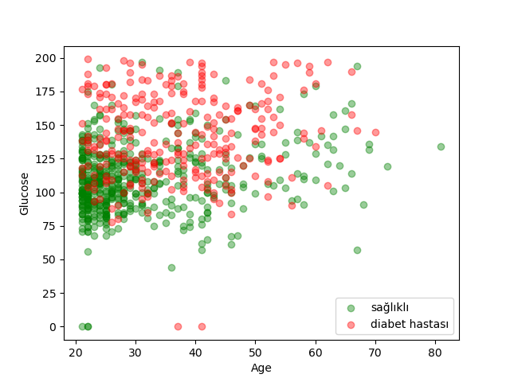

Şeker Hastalığı Tahmini (KNN Algoritması ile)
Bu proje, bir kişinin sağlık verilerine dayanarak (glikoz oranı, yaş, vb.) şeker hastası olup olmadığını tahmin eden bir Makine Öğrenmesi modelidir.
Model, sınıflandırma problemlerinde oldukça popüler olan K-Nearest Neighbors (KNN) algoritmasını kullanmaktadır.
Proje Özeti
Bu çalışmada, verilerin yapay zeka tarafından daha iyi anlaşılabilmesi için Normalizasyon işlemi uygulanmış ve en doğru tahmini yapabilmek için en ideal K (komşu sayısı) değeri aranmıştır.

Veri Seti Analizi ve Hazırlık
Görselleştirme: Veri seti içerisinde sağlıklı ve hasta bireylerin dağılımı matplotlib ile incelenmiştir.
Normalizasyon: Veri setindeki değerlerin birbirini ezmemesi için tüm veriler 0 ile 1 arasına ölçeklendirilmiştir
Eğitim ve Test Ayrımı: Verinin %80'i modelin öğrenmesi, %20'si ise modelin başarısını test etmek için ayrılmıştır.

Sonuçlar
Kodun son bölümünde yapılan testlerde, farklı K değerleri için doğruluk oranları hesaplanmıştır.
Bu sayede modelin en kararlı çalıştığı komşu sayısı belirlenmiştir.

